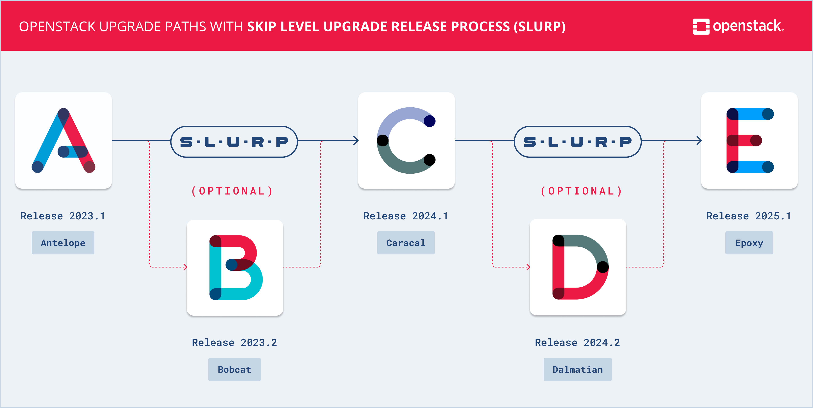

====================
 OpenStack Releases
====================

Release Series
==============

OpenStack is developed and released around 6-month cycles. After the initial
release, additional stable point releases will be released in each release
series. You can find the detail of the various release series here on their
series page. Subscribe to the `combined release calendar`_ for continual
updates.

.. _combined release calendar: schedule.ics

.. datatemplate:yaml::
   :source: series_status.yaml
   :template: series_status_table.tmpl

.. toctree::
   :glob:
   :maxdepth: 1
   :hidden:

   hibiscus/index
   gazpacho/index
   flamingo/index
   epoxy/index
   dalmatian/index
   caracal/index
   bobcat/index
   antelope/index
   zed/index
   yoga/index
   xena/index
   wallaby/index
   victoria/index
   ussuri/index
   train/index
   stein/index
   rocky/index
   queens/index
   pike/index
   ocata/index
   newton/index
   mitaka/index
   liberty/index
   kilo/index
   juno/index
   icehouse/index
   havana/index
   grizzly/index
   folsom/index
   essex/index
   diablo/index
   cactus/index
   bexar/index
   austin/index
   releases/*

.. note::
   The schedule of `Maintenance phases`_ changed during Ocata
   and also during 2024.1 Caracal.
   The `old phases`_ were used until Newton.
   The last series that transitioned to Extended Maintenance was Xena.
   The replacement of Extended Maintenance process to Unmaintained
   was formulated in the `2023-07-24 Unmaintained status replaces
   Extended Maintenance`_ resolution.

.. _extended-maintenance-note:

.. note::
   If a branch is marked as Extended Maintenance, that means individual
   projects can be in state *Maintained*, *Unmaintained*, *Last* or
   *End of Life* on that branch. Please check specific project about its
   actual status on the given branch.

.. _Maintenance phases: https://docs.openstack.org/project-team-guide/stable-branches.html#maintenance-phases
.. _old phases: https://github.com/openstack/project-team-guide/blob/1c837bf0~/doc/source/stable-branches.rst
.. _2023-07-24 Unmaintained status replaces Extended Maintenance: https://governance.openstack.org/tc/resolutions/20230724-unmaintained-branches.html

Series-Independent Releases
===========================

Some deliverables are released independently from the OpenStack release series.
You can find their releases listed here:

.. toctree::
   :maxdepth: 1

   independent

.. _slurp:

Releases with Skip Level Upgrade Release Process (SLURP)
========================================================

Releases can be marked as `Skip Level Upgrade Release Process`_ (or
`SLURP`) releases. This practically means, that upgrades will be
supported between these (`SLURP`) releases, in addition to between
adjacent major releases. For example the upgrade paths starting with
the 2023.1 Antelope release look like this:

.. _Skip Level Upgrade Release Process: https://governance.openstack.org/tc/resolutions/20220210-release-cadence-adjustment.html

Teams
=====

Deliverables are produced by `project teams`_. Here you can find all OpenStack
deliverables, organized by the team that produces them:

.. toctree::
   :maxdepth: 1
   :glob:

   teams/*

.. _project teams: https://governance.openstack.org/tc/reference/projects/index.html

Cryptographic Signatures
========================

Git tags created through our release automation are signed by
`centrally-managed OpenPGP keys`_ maintained by the `OpenStack
TaCT SIG`_. Detached signatures of many separate release
artifacts are also provided using the same keys. A new key is
created corresponding to each development cycle and rotated
relatively early in the cycle. (Implementation completed late in the
Newton cycle, so many early Newton artifacts have no corresponding
signatures.) Copies of the public keys can be found below along with
the date ranges during which each key was in general use.

.. signingkeys::

.. Static key files are generated with the following command:
   ( gpg --fingerprint --keyid-format=0xlong \
   --list-options=no-show-uid-validity,show-unusable-subkeys --list-sigs \
   0x80fcce3dc49bd7836fc2464664dbb05acc5e7c28 ; gpg \
   --armor --export 0x80fcce3dc49bd7836fc2464664dbb05acc5e7c28 ) > \
   doc/source/static/0x80fcce3dc49bd7836fc2464664dbb05acc5e7c28.txt

.. _`centrally-managed OpenPGP keys`: https://docs.openstack.org/infra/system-config/signing.html
.. _`OpenStack TaCT SIG`: https://governance.openstack.org/sigs/tact-sig.html

Documentation
=============

Content for this site is automatically generated from the data submitted to
the `openstack/releases`_ git repository. You can learn more about this
repository and the release management team processes in the following
documentation:

.. toctree::
   :maxdepth: 2
   :glob:

   reference/using
   reference/release_models
   reference/deliverable_types
   reference/join_release_team
   reference/reviewer_guide
   reference/release_infra
   reference/process

.. _`openstack/releases`: https://opendev.org/openstack/releases
